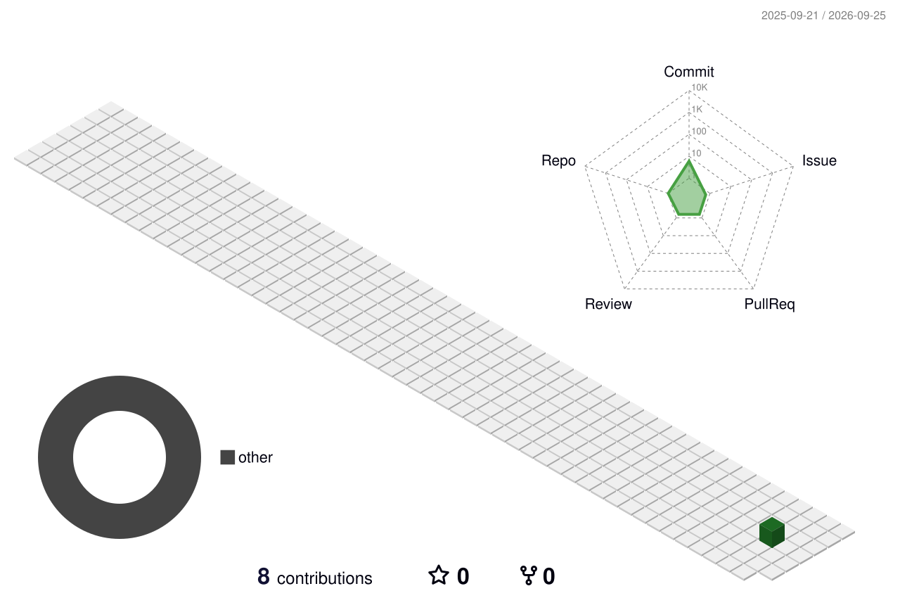

<h1 align="center">Hi 👋, I'm Suryansh Shukla</h1>

<h3 align="center">
Mathematics & Computing Student | Programmer | Problem Solver
</h3>

  

  

---

## 👨‍💻 About Me

I'm a **Mathematics & Computing undergraduate at MITS Gwalior** with a strong interest in **programming, software development, and computational problem-solving**.

My academic background in mathematics has helped me develop a logical and analytical approach to solving complex problems. I enjoy transforming ideas into practical projects while continuously improving my programming and development skills.

### What I'm Focused On

* 🎓 **Bachelor's in Mathematics & Computing** — MITS Gwalior
* 🐍 Building projects with **Python**
* ⚡ Developing my skills in **C++**
* 🌐 Learning **Frontend Development**
* 🧠 Strengthening **Data Structures & Algorithms**
* 🔬 Exploring **Computer Science & Software Development**
* 🚀 Learning through projects, experimentation, and continuous practice

---

## 🛠️ Languages & Tools

---

## 📚 Currently Learning

---

## 📊 GitHub Statistics

  
  

---

## 🔥 GitHub Contribution Activity

  

---

## 🌐 Connect With Me

   

   

  <b>📧 Suryansh28shukla@gmail.com</b>

---

  <i>"Learn. Build. Improve."</i>

  ⭐ Thanks for visiting my profile!

